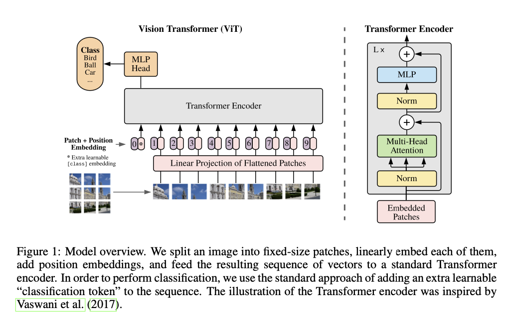

# ViT

To perform classification, a standard approach is to prepend an extra learnable embedding “classification token” [CLASS] to the sequence of embedded patche
$$
\mathbf{Z} \leftarrow \operatorname{concat}([\mathrm{CLASS}], \mathbf{X W})
$$

## patch size 14 x 14是什么意思？

在Vision Transformer（ViT）模型中，"patch size 14 x 14"指的是将输入图像划分为14像素乘14像素的图像块（patch）。这个概念是ViT模型的核心之一，用于将图像数据转化为适合Transformer处理的形式。

### 具体解释：

1. **输入图像**：假设我们有一个输入图像，其尺寸为 $H \times W \times C$，其中 $H$ 是高度，$W$ 是宽度，$C$是通道数（通常是3，表示RGB三通道）。
2. **划分图像块**：将这个图像划分为固定大小的块。在"patch size 14 x 14"的情况下，每个图像块的尺寸为14像素乘14像素。这意味着：
    - 如果图像的高度和宽度是可被14整除的（例如224 x 224），那么图像会被划分为$ (224 / 14) \times (224 / 14) = 16 \times 16$ 个图像块，总共256个图像块。
    - 如果图像尺寸不是14的倍数，通常会在输入图像预处理阶段进行适当的裁剪或填充，使其尺寸适合划分成完整的图像块。
3. **展平和线性映射**：每个14 x 14的图像块展平成一个长度为 $14 \times 14 \times C$ 的向量，然后通过一个线性变换映射到一个固定的维度（比如768维），形成图像块的嵌入表示。
4. **位置编码**：为了保留图像块的位置信息，给每个块添加位置编码，这样模型可以识别每个块在原始图像中的位置。
5. **输入Transformer**：将所有图像块的嵌入表示（包含位置编码）作为序列输入到Transformer编码器中进行处理。

### 优点：

- **减少计算量**：相比于直接处理整个图像，将图像划分为较小的块可以显著减少计算量。
- **适应Transformer架构**：这种方法使得Transformer可以处理视觉数据，类似于处理自然语言中的单词序列。

### 举例说明：

假设输入图像是224 x 224 x 3，使用14 x 14的图像块：

- 每个图像块的尺寸是14 x 14 x 3。
- 每个图像块展平成一个长度为588（即14 x 14 x 3）的向量。
- 每个向量通过线性变换映射到一个固定维度（例如768维）。
- 最终得到16 x 16个嵌入表示，每个表示是一个768维的向量。
- 这些向量序列输入到Transformer模型中进行进一步处理。

原论文：https://arxiv.org/abs/2010.11929